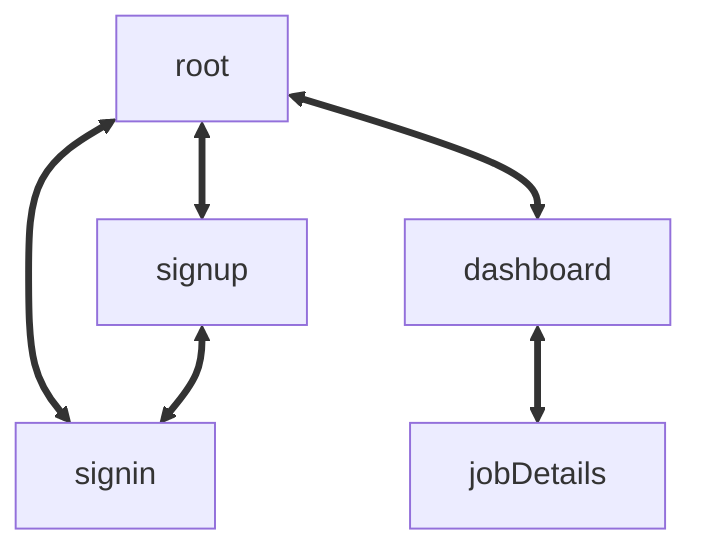

## Architecture

### DB
```mermaid
classDiagram
    class jobs
    jobs: int id
    jobs: string company
    jobs: date applyDate
    jobs: ["applied" | "rejected" | "interview" | "accepted"] status
    jobs: date statusDate
    jobs: string userId
    jobs: string content

    jobs: (/api/trpc/jobs/add) {job}
    jobs: (/api/trpc/jobs/get) {string userId, number jobId}
    jobs: (/api/trpc/jobs/update) {job}
    jobs: (/api/trpc/jobs/getForUser) {string userId}
```

### Routes


### Folder structure
```
src
├───components
│   ├───loading
│   └───ui
├───lib
├───pages
│   ├───api
│   │   └───trpc
│   ├───dashboard
│   │   └───[user]
│   ├───error
│   ├───sign-in
│   └───sign-up
├───server
│   ├───api
│   │   └───routers
│   └───db
│       └───schema
├───styles
└───utils
```