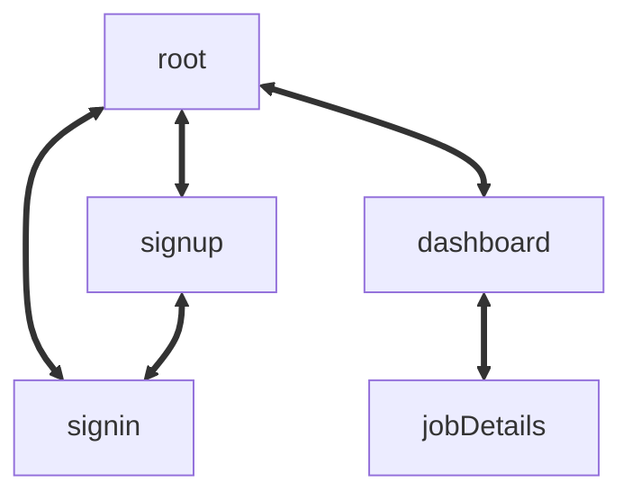

## Architecture

### DB
```mermaid
classDiagram
    class jobs
    jobs: int id
    jobs: string company
    jobs: date applyDate
    jobs: ["applied" | "rejected" | "interview" | "accepted"] status
    jobs: date statusDate
    jobs: string userId
    jobs: string content

    jobs: (jobDb.add) {job}
    jobs: (jobDb.getById) {string userId, number jobId}
    jobs: (jobDb.update) {job}
    jobs: (jobDb.getAll) {string userId}
```

### Routes
